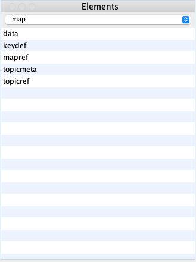
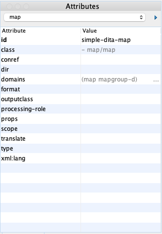

# Creating the `simple_ditamap` framework

Having created the topic framework `simple_dita`, the next task is to create a map framework. For simplicity's sake, let's call it `simple_ditamap`.

1.  If the **Preferences** dialog is not already open, go to **Options**\>**Preferences**\>**Document Type Association**.

2.  Click **DITA Map** and then **Extend**.

3.  In the **Document type** dialog that opens:

    1.  Give the new framework a **Name**. I used *SIMPLE DITAMAP*.

    2.  Set **Priority** to **Highest**.

    3.  Set **Storage** to **External**, and click the folder icon to navigate to the `simple_ditamap` folder within your `customer_frameworks` folder.

    4.  On the **Classpath** tab, select the `${baseFramework}/resources` row and click the wrench icon.

        Change the content in the **Directory** field to `${frameworkDir}/resources/` and click **OK**. In this case, the `${frameworkDir}` variable contains the path to the `custom_frameworks/simple_ditamap` folder.

    5.  On the **Templates** tab, select all the rows and click the X icon to delete them all. Click the **+** icon, and enter `${frameworkDir}/templates/` in the **Directory** field and click **OK**.

    6.  On the Author tab, edit the **Menu**, **Contextual Menu**, **Toolbar**, and **Content Completion** sub-tabs, to add or remove any icons not relevant to your framework.

    7.  Click **OK**, and then **OK** again close the **Preferences** dialog.

Once completed, your Elements and Attributes windows in Oxygen look like the examples below:

|||

**Parent topic:**[Simplifying DITA](simplifying-dita.md)

