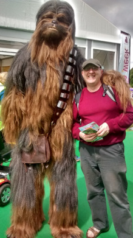

# Hello

I am Michael McLoughlin, a professional technical writer based in Belfast, N. Ireland - that's me on the right.

This site started out as a place for me to write up content on esoteric DITA and DocOps subjects that I had researched to solve real world documentation problems.

It then occurred to me that this content could also serve as a portfolio of work that prospective employers could peruse to get idea of my writing skills and the kind of things that interested me as a technical writer.

Please feel free to look around.

## About this site

This is just some information for the curious on the tools used to construct this site.

Most of the content is written in a simplified sub-set of DITA 1.3 tags, except for the MDITA section which is written, appropriately enough, in the Lightweight DITA \(LwDITA\) 1.0 variant MDITA.

The content is converted from DITA to GitHub-Flavored Markdown using LwDITA plugin bundled with the DITA Open Toolkit. It is then converted to HTML using the MkDocs static site generator.

