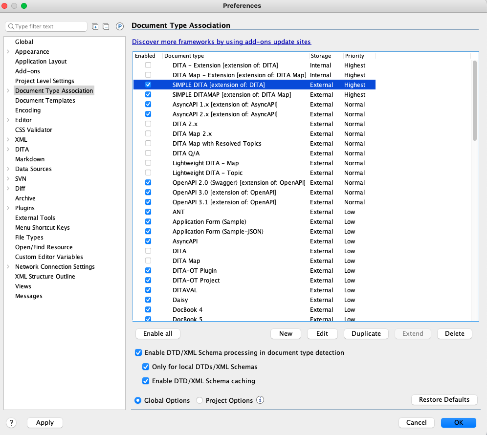
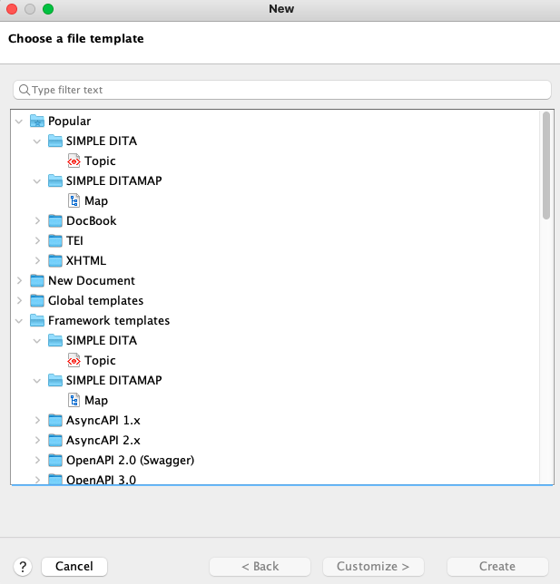

# Sharing the frameworks and layout

If you have saved the layout and custom framework files to GitHub repository, or shared location on your network, installing them is very straightforward:

1.  First, clone the repository \(or open the network location\), where the files have been saved.

2.  To install custom editor layout in Oxygen, click **Window**\>**Load Layout**\>**Custom**, locate and select the `.layout` file. Then, click **Open**.

    Your editor layout updates automatically.

3.  To install the frameworks, first set the location of the new framework files:

    1.  In the Oxygen UI, go to **Options**\>**Preferences**\>**Document Type Association**\>**Locations**, and click **Add**.

    2.  In the **Choose frameworks directory** dialog that appears, navigate to the `custom_ frameworks` folder, and click **OK**.

        The path to your `custom_ frameworks` folder appears in the **Additional frameworks directories** list.

    3.  Click **OK** to save.

4.  Next got to **Options**\>**Preferences**\>**Document Type Association** where you should the new frameworks installed. Deselect any other frameworks that reference DITA and click **OK**. The example below is from my machine:

    

    The Elements and Attributes windows should reflect the restricted choices created in the `cc_config.xml` file. If they don't, close and reopen Oxygen.

5.  To check for the new templates, click **File**\>**New**. The **Choose a file template** dialog shows the new Topic and Map templates.

    

## How do I undo all this?

Undoing the changes imported above is very simple.

1.  To return to the default Oxygen layout, click **Window**\>**Load Layout**\>**Default**.

2.  To return to the default DITA elements, attributes and templates, go to **Options**\>**Preferences**\>**Document Type Association** and deselect the new templates your you imported. Select all the other frameworks that mention DITA and click **OK**. You may need to restart Oxygen to changes. That's it!

**Parent topic:**[Simplifying DITA](simplifying-dita.md)

